# Simple projections for COVID-19 case growth in Lithuania

## Total infection cases

## Total death cases
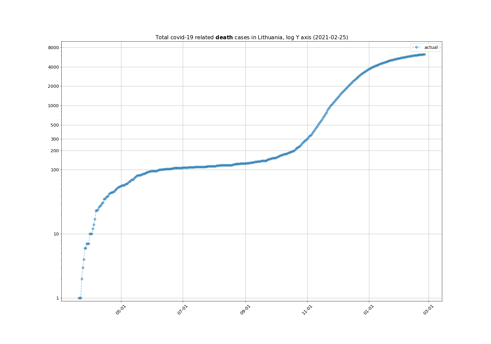

## Daily new cases
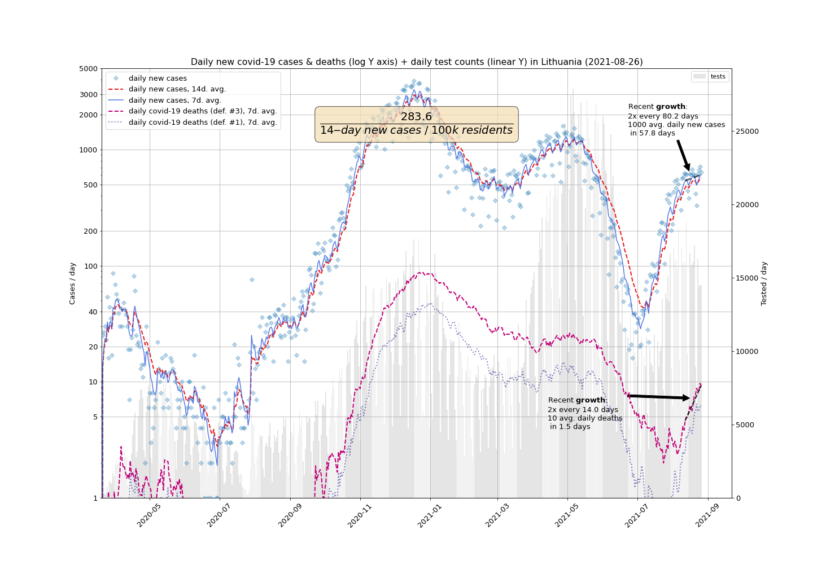

## LogLog plot of Daily new cases against total cases
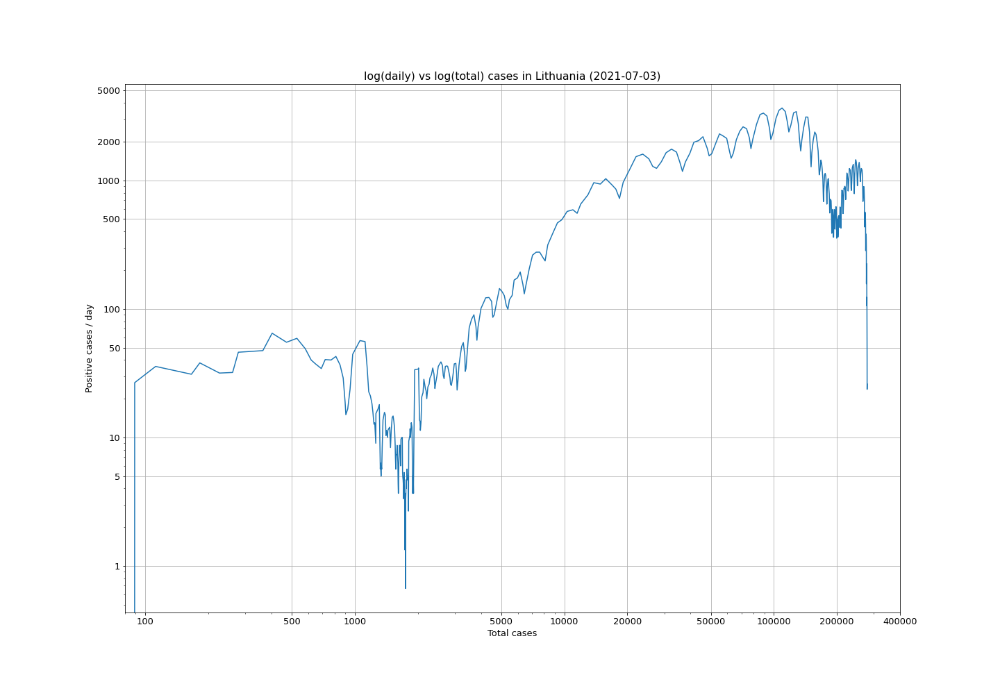

## Confirmed cases histogram by sex and age (last 14 days)
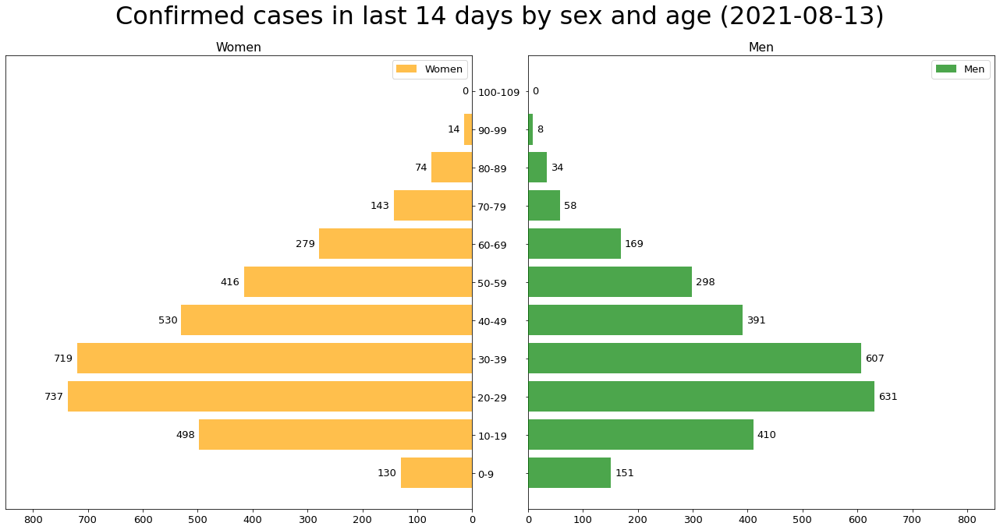

## Death rate in % by sex and age
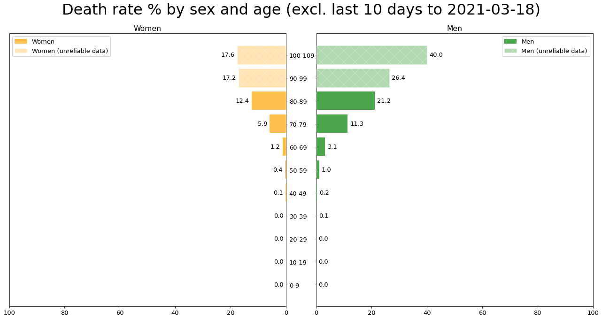

## Confirmed cases by sex and location (last 14 days)
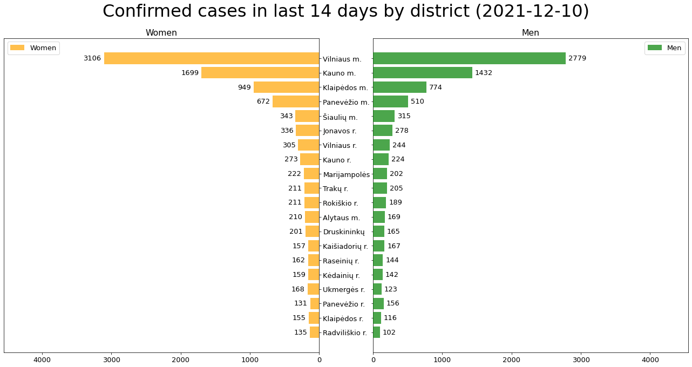

## Confirmed cases per 100k population by district (last 14 days)
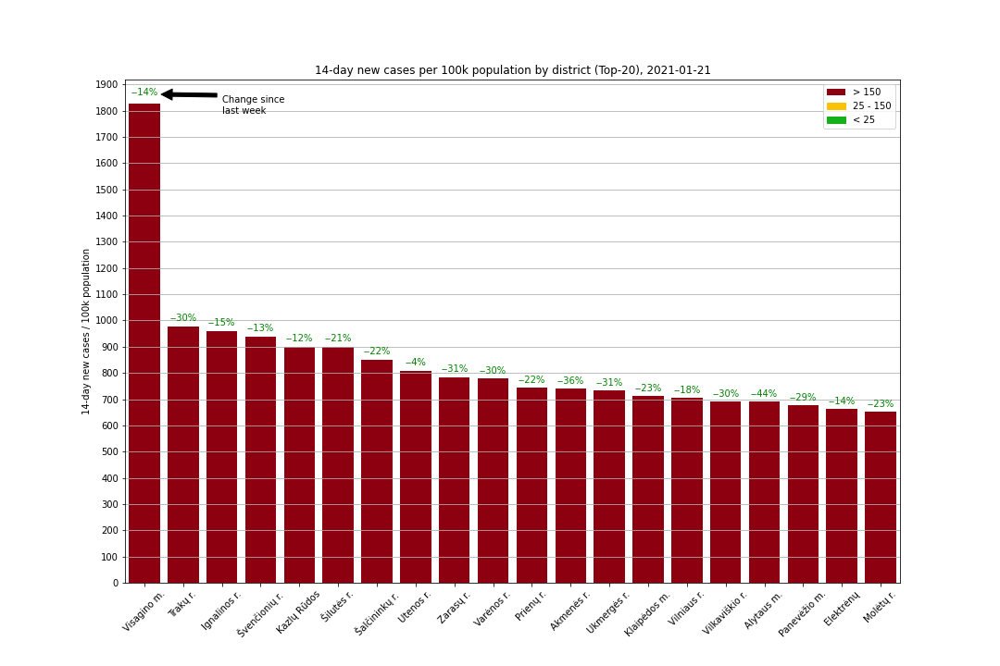

## Hospitalization
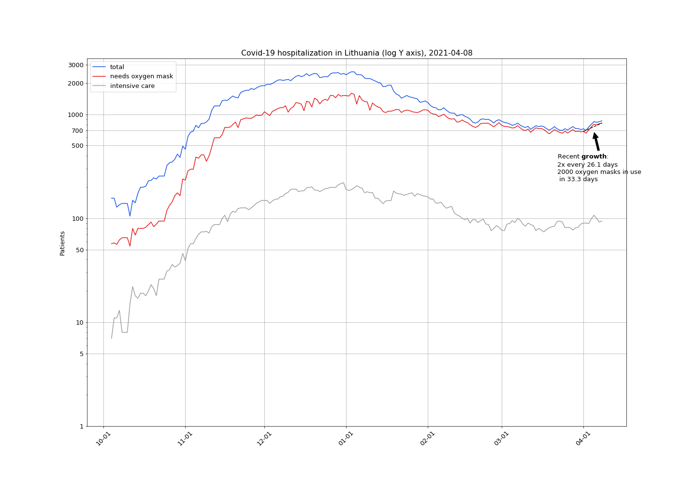

## Postitive tests %
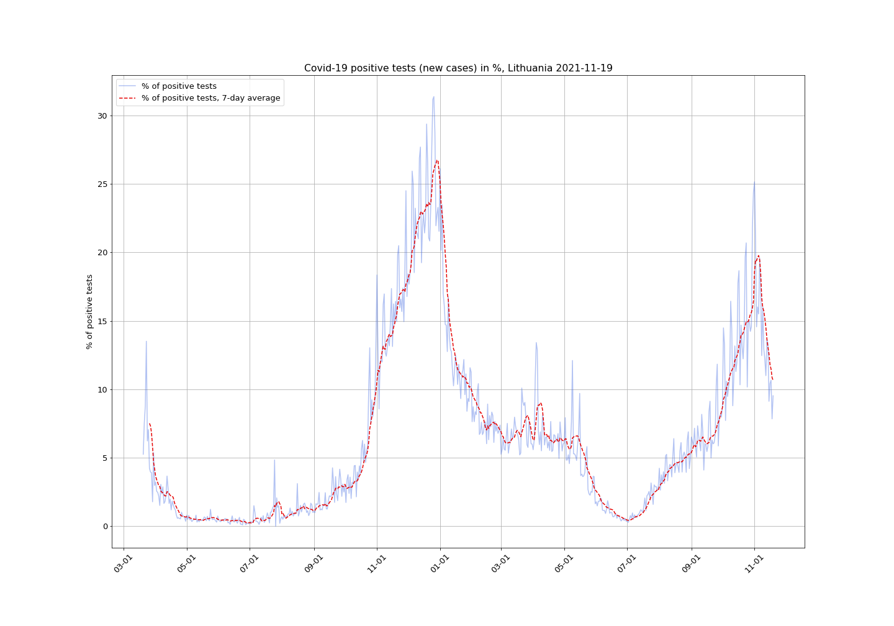

## Daily new cases week over week
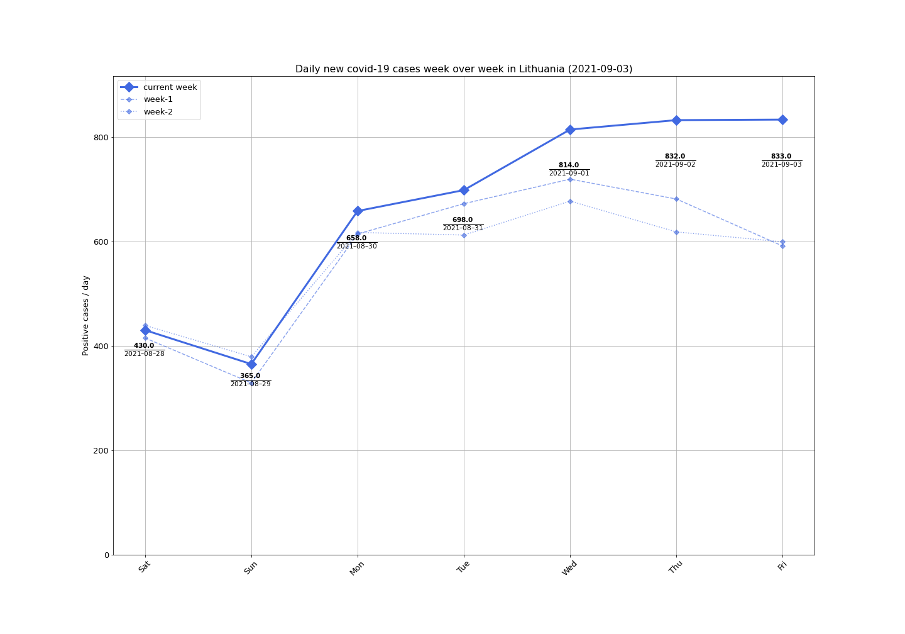

## Daily tests week over week
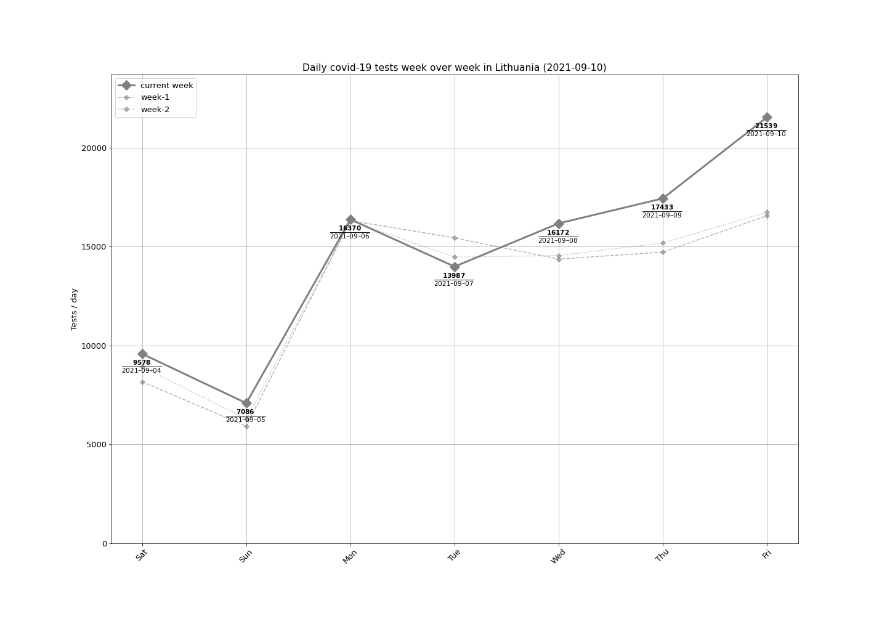

## Daily deaths week over week
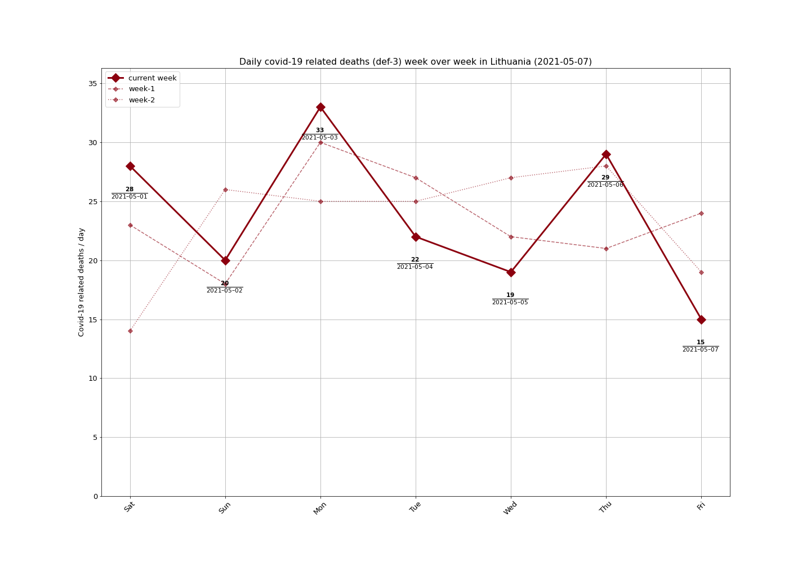

## Apple mobility data for Lithuania
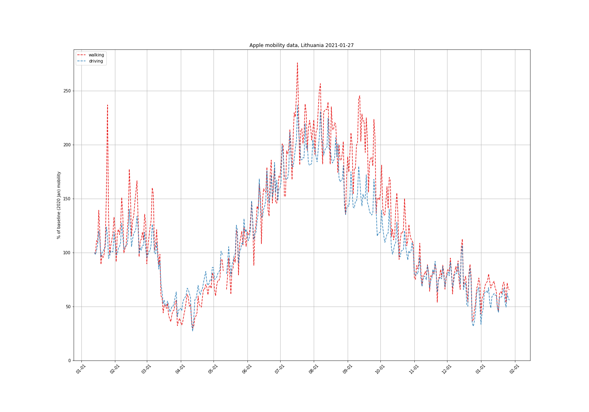

## Increased / decreased chances of being diagnosed with COVID-19 by the age groups
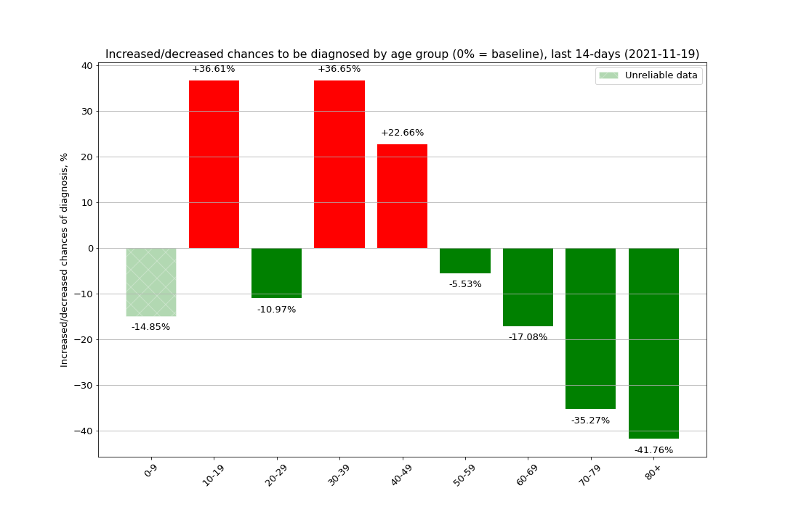

## Lithuania case growth by test positive percentage by district
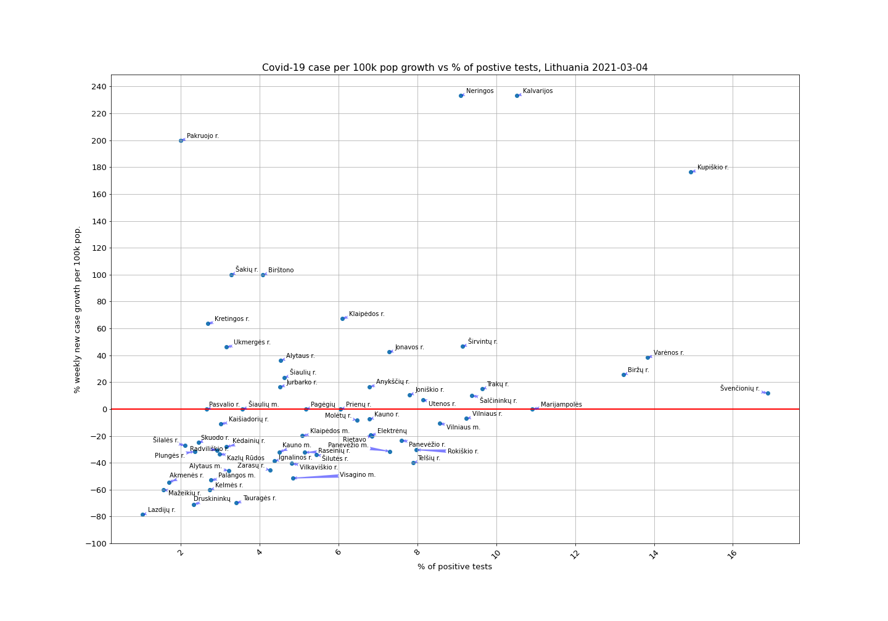

## Positive test percentage map
[postive_pct_animation](postive_pct_animation)

## Data sources
- [https://github.com/mpiktas/covid19lt](https://github.com/mpiktas/covid19lt)

