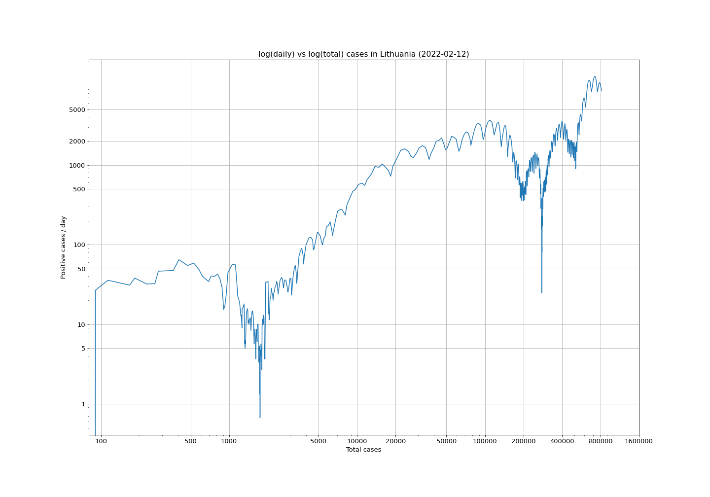
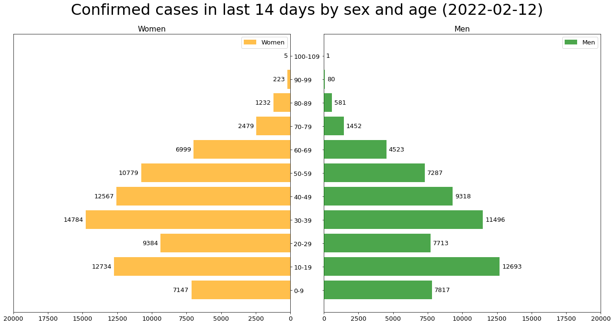
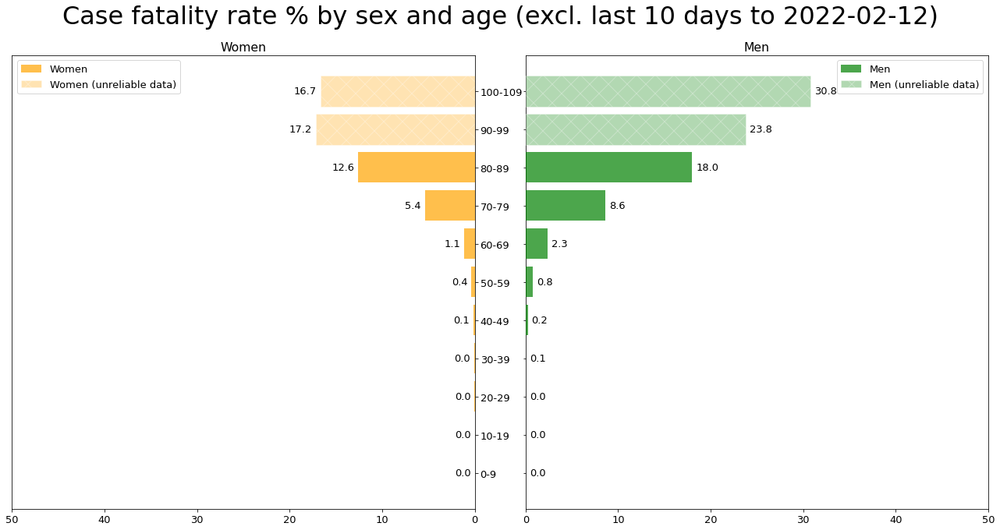
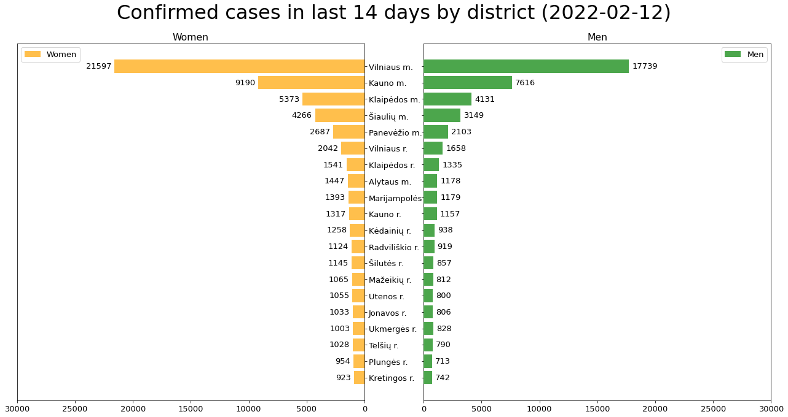
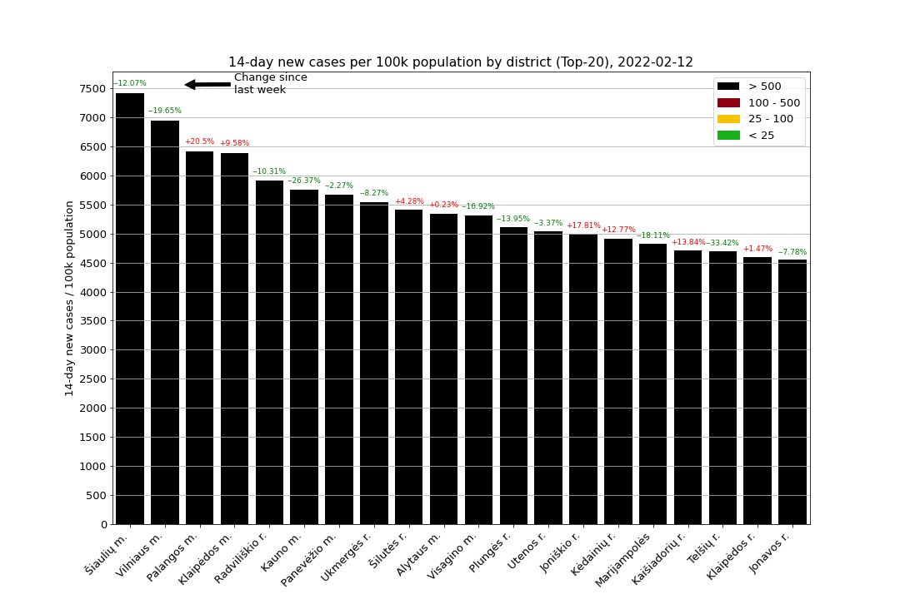
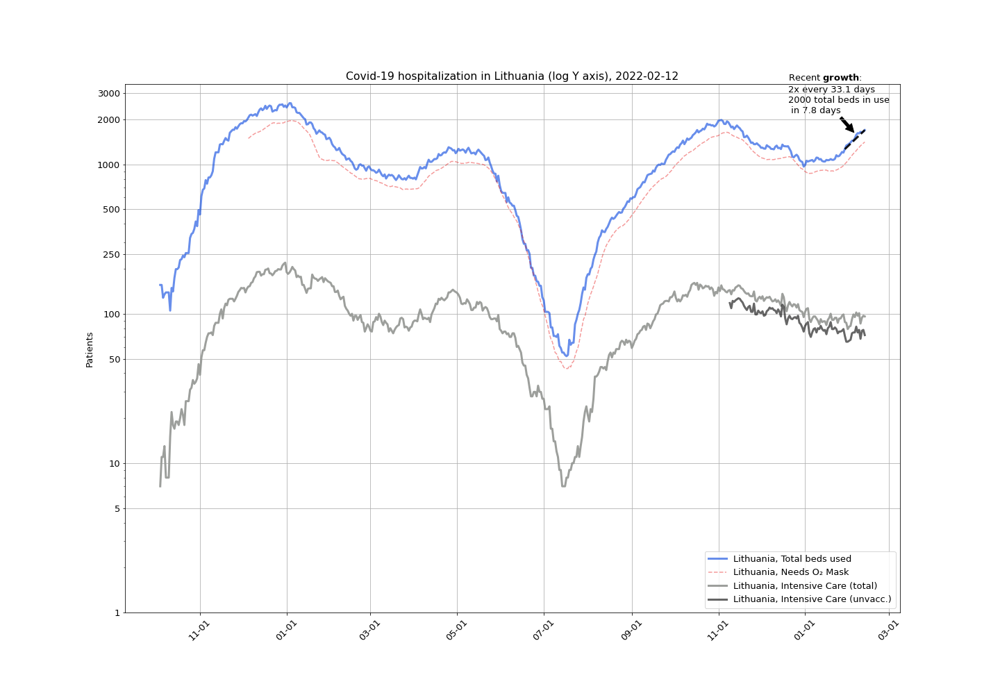

# Simple projections for COVID-19 case growth in Lithuania

## Total infection cases

## Total death cases

## Daily new cases

## LogLog plot of Daily new cases against total cases

## Confirmed cases histogram by sex and age (last 14 days)

## Death rate in % by sex and age

## Confirmed cases by sex and location (last 14 days)

## Confirmed cases per 100k population by district (last 14 days)

## Hospitalization

## Postitive tests %

## Data sources
- [https://github.com/mpiktas/covid19lt](https://github.com/mpiktas/covid19lt)

